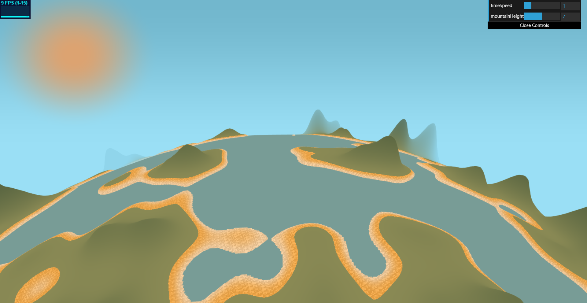

# CIS 566 Homework 1: Noisy Terrain

## ID
 - __Name:__ Jiangping Xu
 - __PennKey:__ xjp

Citation
----------
[Perlin Noise from Wikipedia](https://en.wikipedia.org/wiki/Perlin_noise)

Demo
---------
https://haco77.github.io/hw01-noisy-terrain

Implementation Details
----------
- I exploit the FBM function with perlin noise to generate a height field. The height is then mapped to another distribution using a cubic function, which makes coast flat and mountains steep. I set the land with a height below a threshold the color blue and raise it, pretending to be the sea.

- I project the plane to a sphere to make it look like a planet.

- I animate the sea by passing time to the shader as a uniform variable and calculate the sea level based on time and the coordinates using Trigonometric function.

- I interpolate the color smoothly between sun and sky, as well as in sky itself, which I give a darker blue at the higher position. I also applied this technique to the mountain and the beach. In order to mimic the texture of the sand, I add some noise to the color of the beach. I use "scaled and rounded" coordinates as the input of that noise to control the size of noise points.

Scene Shot
---------
